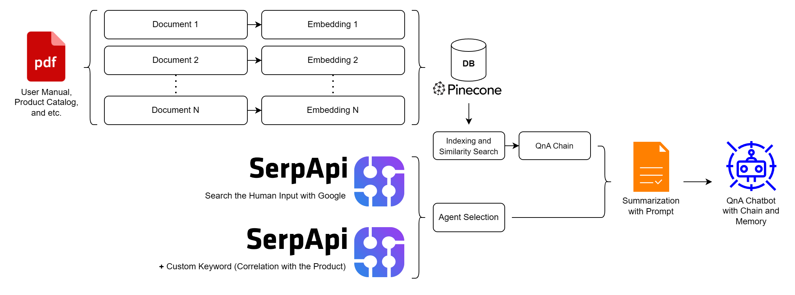

# Product QnA

This part explain about how this **Product QnA** works, how to setup and use this project. The code explanation were wrote sepately in [`notebook/Product Question and Answer.ipynb`](https://github.com/rohwid/product-question-and-answer/blob/master/notebook/Product%20Question%20and%20Answer.ipynb), it explain all about tools, function, module and etc for this project. All of this project used the code that explained in that file.

This project will take the search result from PDF content and Google search with SerpAPI. **The output from the PDF file and Google search results will make the OpenAI know more about the current product that was released lately** (e.g. **Samsung Galaxy S23** was officially released in **February 2023**). Even though the ChatGPT or GPT-3 was trained using the public web text data up to 2021.

## Project Setup

Here are some step to setup and runs this project.
1. The python version that used in this project is **Python3.9**.
2. Don't forget to use **virtualenv** or **venv**. Because of the python SSL certificate called [Certifi](https://stackoverflow.com/questions/42982143/python-requests-how-to-use-system-ca-certificates-debian-ubuntu) that must use when call the [SerpApi](https://serpapi.com/) as part of the Search agent. The SSL certificate were called in the [`params/credentials.yml`](https://github.com/rohwid/product-question-and-answer/blob/master/params/credentials.yml) file with the `REQUESTS_CA_BUNDLE` and the `REQUESTS_CA_BUNDLE_NOTEBOOK` variables. So, let's create the python virtual environment like this command or you can use another way to create it.

        $ virtualenv venv -p /usr/bin/python3.9

3. Activate the python virtual environment.

        $ source venv/bin/activate

4. Continue by installing all the packages and each version that already saved in [`requirements.txt`](https://github.com/rohwid/product-question-and-answer/blob/master/requirements.txt).

        $ pip install -r requirements.txt

5. Don't forget to fill all the credentials that required in [`params/credentials.yml`](https://github.com/rohwid/product-question-and-answer/blob/master/params/credentials.yml).
6. Also don't forget to fill `PRODUCT`, `MUST_EXIST_PRODUCT_WORD`, and `ONE_OR_MORE_PRODUCT_WORD` variables in [`params/app.yml`](https://github.com/rohwid/product-question-and-answer/blob/master/params/app.yml) file. It use to determine **your product name (e.g Samsung Galaxy S23)** and the agent selection, to know more please take a look in the [Project Overview](https://github.com/rohwid/product-question-and-answer#project-overview) section in point number four.
7. And continue to launch the Product QnA Chatbot.

        $ python console.py

8. To access the notebook file [`notebook/Product Question and Answer.ipynb`](https://github.com/rohwid/product-question-and-answer/blob/master/notebook/Product%20Question%20and%20Answer.ipynb), just activate the notebook like this command.

        $ jupyter-notebook

    Then open the [`notebook/Product Question and Answer.ipynb`](https://github.com/rohwid/product-question-and-answer/blob/master/notebook/Product%20Question%20and%20Answer.ipynb) file.

## Project Overview

Following the figure above, there are many implementations of the Langchain modules that described below from left to the right.

+ Firstly is about the PDF loader that loads the PDF file and then chunks it into many documents. Then continue by embedding each document content and upsert to the [Pinecone](https://www.pinecone.io/) database as vectors. The new PDF document can be added by put the PDF file location on a list inside `PDF_SOURCE` variable inside [`params/app.yml`](https://github.com/rohwid/product-question-and-answer/blob/master/params/app.yml) file. Then continue by open [`query/upsert_pdf_vector_data.py`](https://github.com/rohwid/product-question-and-answer/blob/master/query/upsert_pdf_vector_data.py) and change `pdf_list_number` variable with the number of the list where you put PDF file location in [`params/app.yml`](https://github.com/rohwid/product-question-and-answer/blob/master/params/app.yml).
  
    **Other helpful scripts**:
    + [`query/list_and_describe_index.py`](https://github.com/rohwid/product-question-and-answer/blob/master/query/list_and_describe_index.py) can be use to check the list and the description of the Pinecone database index.
    + And [`query/delete_all_vector_data.py`](https://github.com/rohwid/product-question-and-answer/blob/master/query/delete_all_vector_data.py) can be use to delete all vector data from the Pinecone database index.

+ Secondly is about performing Similarity Seach by Indexing the vector from Pinecone database and get the similar documents.
+ Third is the continuation of the Similarity Search that produces results about some similar documents. Then the QnA chain from Langchain module with OpenAI model will perform QnA by asking some question with **the human input** as the question.
+ Fourth is about agent selection that will select which agent that will perform. The Agent selection is depend on **the human input** or question, are there contains the **product name** that already write inside [`params/app.yml`](https://github.com/rohwid/product-question-and-answer/blob/master/params/app.yml) with `PRODUCT` variable. There are two agent, first agent corespond to do search with Google directly with **the human input** and the second agent corespond to to search with Google but add some keyword about the correlation with the product. The main purpose of this step is to reduce the Chatbot's reply time and [SerpApi](https://serpapi.com/) usage, if compared with the both Agent worked together.

    **Agent selection process**:
    + The selection process are depend to the `MUST_EXIST_PRODUCT_WORD` and the `ONE_OR_MORE_PRODUCT_WORD` variables in [`params/app.yml`](https://github.com/rohwid/product-question-and-answer/blob/master/params/app.yml).
    + If the human input not contains word in `MUST_EXIST_PRODUCT_WORD`, then it will call the second agent.
    + If the human input contains word in `MUST_EXIST_PRODUCT_WORD` and not contain any words in `ONE_OR_MORE_PRODUCT_WORD` list, then it will call the second agent.
    + If the human input contains word in `MUST_EXIST_PRODUCT_WORD` and one of the words in `ONE_OR_MORE_PRODUCT_WORD` list, then it will call the first agent.
    + If the human input contains word in `MUST_EXIST_PRODUCT_WORD` and the `ONE_OR_MORE_PRODUCT_WORD` list variable is empty, then it will call the first agent. It means the product only use one word.

+ The result of the third and the fourth process will be summarized by prompting some command to instruct the OpenAI model.
+ The next step are prompting to instruct the OpenAI model to perform as Chatbot and consider the result of the summarization that comes from the information from the product User Manual's, Catalog's and etc also from the Agent that get some product information from the Google.
+ And the last step is the Chatbot will use Chain from Langchain library to relate or connect with the previous chat history and **the human input** that manage by Memory module from Langchain.

## Project Demo

In this project I would like to implement the Langchain module as many as I can (e.g prompt templates,
indexes, chains, agents, memory). Probably right now I come up with the bare minimum of visualization or User Interface (UI), that's Command Line :sweat_smile:

https://github.com/rohwid/product-question-and-answer/assets/9447439/3bf16ebb-3e3c-4937-bca0-6c9f75a2cdb0
